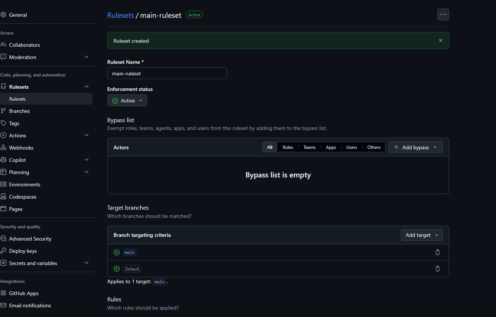
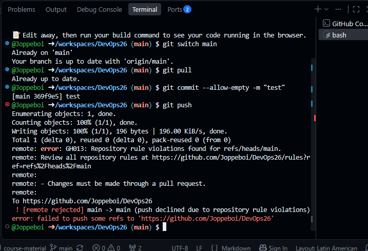
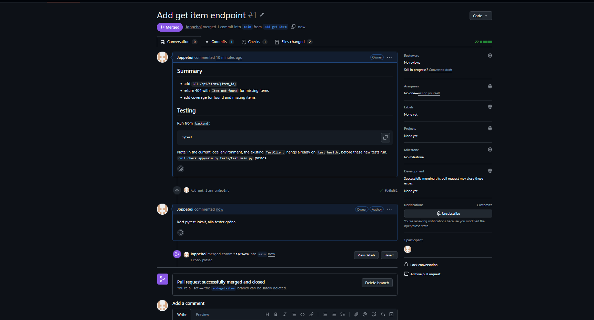
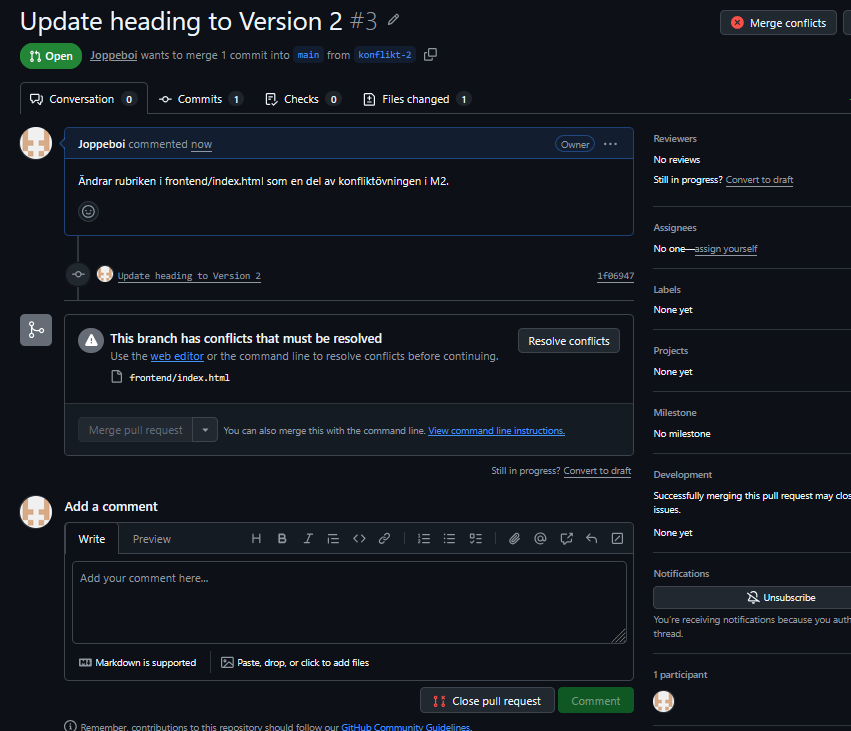

# M2 - Branch protection, review och konfliktövning

Genomförd solo.

## Steg 1, Branch protection aktiverad

Skapade en ruleset som gäller main-branchen med kravet "Require a pull request before merging" och Required approvals satt till 0 då jag kör solo.

## Steg 2, Testade skyddet

Försökte pusha en tom commit direkt till main. Pushen avvisades med felmmeddelande om skydda branch.

## Steg 4, Pull request och självgranskning

PR: [add-get-item](https://github.com/Joppeboi/DevOps26/pull/1)

Hade codex att lägga till enpointen GET /api/items/{item_id} i backend/app/main.py samt två tester i test_main-py. Codex fixade sedan en pull request som jag kommenterade, mergade sedan PR:en och tog bort branchen.

## Steg 5, Merge konflikt

Skapade två branches (konflikt-1, konflikt-2) från samma commit och ändrade samma rad i frontend/index.html till olika värden i varje branch. Mergade konflikt-1 först. Konflikt-2 fick du en konflikt på Github- Löste konflikten lokalt med "git merge origin/main", kombinerade raden manuelluelt och tog bort konfliktmarkörerna, commitade och pushade lösningen. Mergade sedan PR:n