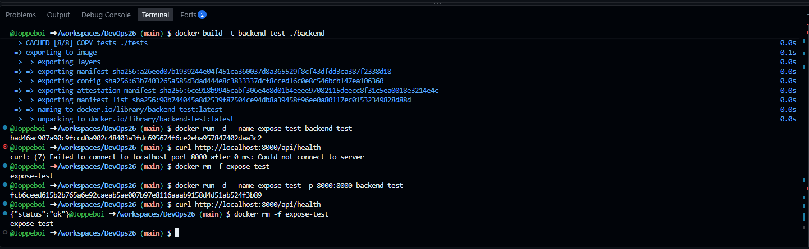
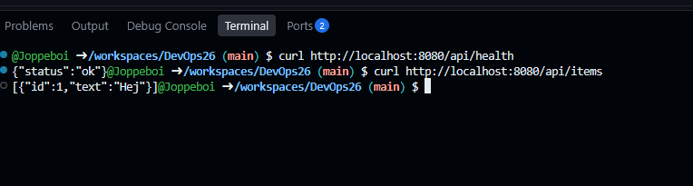
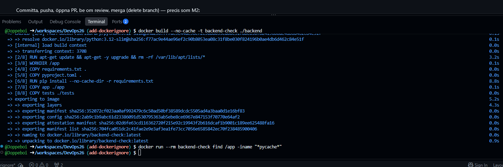
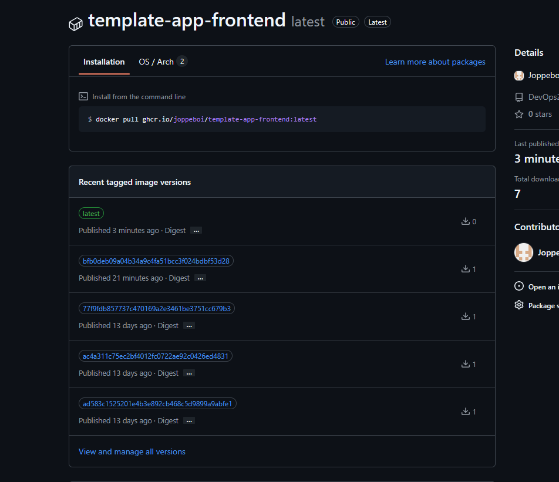

# M3 – Dockerfiles, docker compose och push till GHCR

## Gissningar innan körning

**1. Vilken rad avgör Python-versionen?**
Rad 1

**2. Varför kommer `COPY requirements.txt .` och `RUN pip install` före `COPY app ./app`?**
Docker bygger imagen i lager och cachar varje lager. Om ett lager ändras byggs det och alla lager efter det om. Beroendena i requirements.txt ändras inte ofta och eftersom det i ändras ofta i app/ så skulle requirements.txt ofta uppdateras helt i onödan.

**3. Gör `EXPOSE 8000` porten nåbar utanför containern?**
Min gissning: Nej.
Resultat: Nej. EXPOSE är bara dokumentation. Porten blir nåbar först när den publiceras med `-p 8000:8000`

## Frågor om frontend/Dockerfile (steg 2)

- **Varför ingen RUN-rad?** Frontend består av statiska filer som bara kopieras in. Inget behöver installeras eller byggas.
- **Varför inget eget CMD?** Basimagen `nginxinc/nginx-unprivileged:alpine` har redan ett CMD som startar nginx.
- **Var kommer namnet `backend` ifrån?** Det är tjänstenamnet i docker-compose.yml.
- **Varför nginx-unprivileged?** Den kör som icke-root och lyssnar på 8080, så den fungerar på plattformar som Rahti som startar containrar med en slumpmässig icke-root-användare.

## Skärmdump 1 – EXPOSE jämfört med -p

Med `-p 8000:8000` svarade `/api/health` med `{"status":"ok"}`. EXPOSE öppnar alltså ingen port.

## Skärmdump 2 – Hela appen med docker compose

`docker compose up --build` startade båda tjänsterna. Jag öppnade appen via Codespace-länken för port 8080, och API:t svarade via nginx-proxyn.

## Skärmdump 3 – .dockerignore

Före .dockerignore hamnade `__pycache__` i imagen. Efter blev utskriften tom. Ändringen mergades via en PR.

## Skärmdump 4 – Push till GHCR

Jag pushade båda images till GHCR. Min `:latest`-push syns med färsk tidsstämpel under Versions.