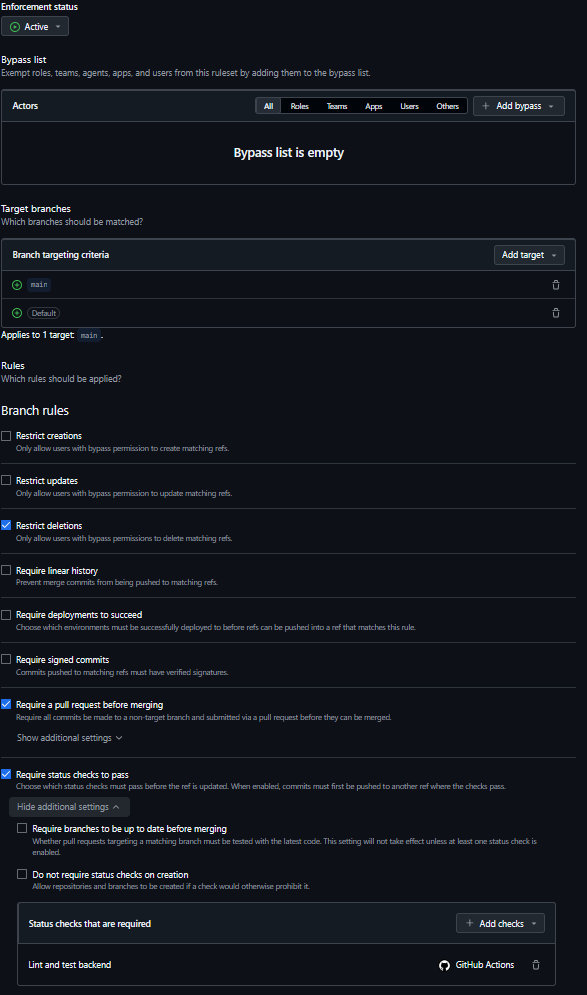
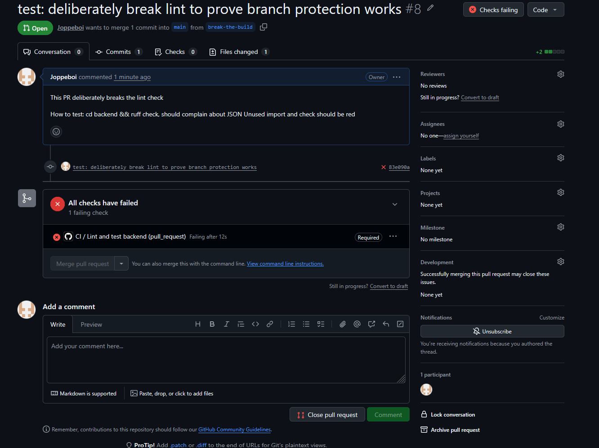
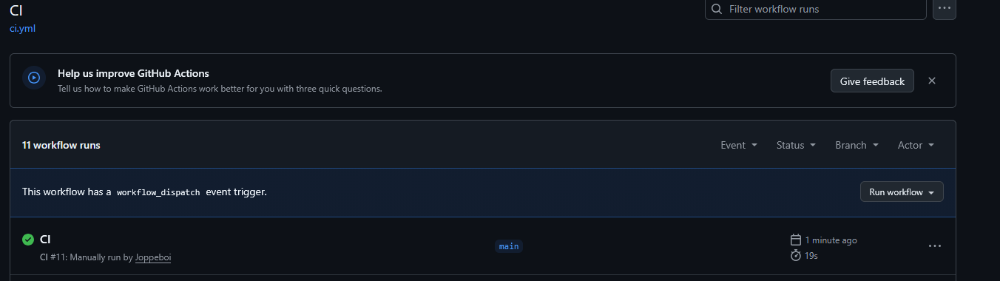

# M5 – Obligatorisk CI-check

## 1. Rulesetet kräver Lint and test backend

<!-- Dina egna meningar här -->

## 2. En röd PR blockeras

<!-- Dina egna meningar här -->

## 3. Manuell körning med workflow_dispatch

<!-- Dina egna meningar här -->